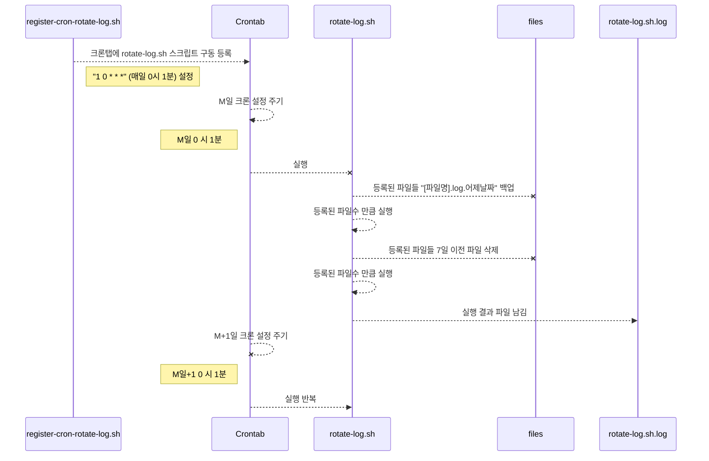

ReadMe
===

사용법:
<procedure>
<step> register-cron-rotate-log.sh 과 rotate-log.sh 같은 위치에 위치 시킨다.</step>
<step>register-cron-rotate-log.sh 을 실행한다.</step>
<p>* 변경 사항이 있을 경우 register-cron-rotate-log.sh 을 다시 실행한다.</p>
</procedure>

실행구조



### register-cron-rotate-log.sh

___
[스크립트](#register-cron-rotate-log.sh "쉘 스크립트")를 실행 하면 rotate-log.sh을 실행하는 cron을 crontab에 등록한다.

* crontab에 cron을 등록해주는 shell 스크립트
* rotate-log.sh과 한쌍이다.
* .backup 디렉토리를 만들고 아래 내용을 백업해 놓는다.
* crontab 등록전 이전 crontab 목록(crontab -l) 을 before_crontab.txt에 백업한다.
* crontab 등록 후 shell 실행 명령을 .register-history 에 입력한다.
* crontab 등록 후 등록한 크론을 current_app_cron.txt에 백업한다. **(register 재 실행시 이 파일을 보고 cron을 변경함.)**

> * <b>주의! .register-history 에서 크론 스케줄은 1 0 * * * 다음과 같이 표시 되더라도 실제 사용 할 때는 "" (double quotes) 로 감싸야 한다. => "1 0 * * *"</b>
> * <b>주의! 크론탭에서 직접 수정한 경우(crontab -e 로 수정한경우) register-cron-rotate-log.sh 실행시 자동으로 변경 되지 않는다.</b>
>
{style="warning"}

예시)

```Bash
sh register-cron-rotate-log.sh -c "1 0 * * *" -f ../log/redis-server.log ../log/redis-sentinel.log

```

크론관련 명령:
> * 크론탭 리스트: crontab -l
> * 크론탭 수정 및 등록: crontab -e

### rotate-log.sh

___

{type="full"}
기본사항
: 1. [스크립트](#rotate-log.sh "쉘 스크립트")를 실행 하면 인자로 받은 [파일]의 [파일명].어제날짜(ex. sample.log.2024-04-07) 파일을 생성 후
[파일] 내용을 [파일명].log.어제날짜 파일에 옮겨 쓴 후 clear 한다.
: 2. 7일 이전 수정이 일어난 파일을 삭제한다.(실제 rm은 주석처리 되어 있으므로 주석 풀어서 사용.)

* 7일전 수정이 일어나 파일명 패턴 파일:

예시)

```Bash
find [파일 위치 디렉토리] -name [파일명].* -mtime +6
```

* 실제 rotate를 실행하는 파일이다.
* multiple 인자를 받는다. 파일명을 포함한 full path, 상대 path 둘다 가능하다.

예시)

```Bash
rotate-log.sh <log_file1> <log_file2> ...
```

* 실행 후 rotate-log.sh.log 파일을 남긴다.

> <b>주의. 7일 이전 수정 파일 삭제 기능의 rm 커맨드는 기본적으로 주석처리되어 있다.</b>